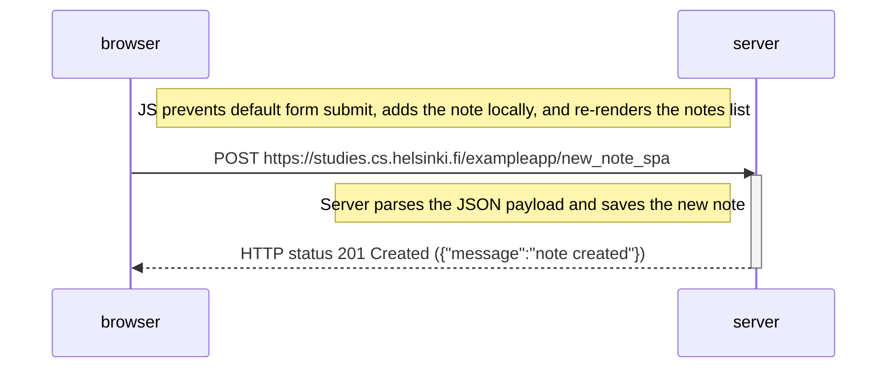

```mermaid
sequenceDiagram
    participant browser
    participant server

    Note right of browser: JS prevents default form submit, adds the note locally, and re-renders the notes list

    browser->>server: POST https://studies.cs.helsinki.fi/exampleapp/new_note_spa
    activate server
    Note left of server: Server parses the JSON payload and saves the new note
    server-->>browser: HTTP status 201 Created ({"message":"note created"})
    deactivate server

```